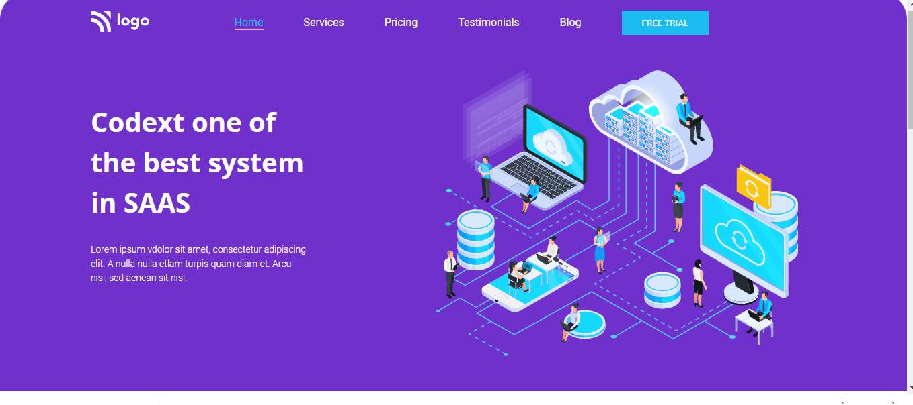

## Name- Anurag Pathak

# SAAS Landing Page

> Project 13

<table>
<tr>
<td>
  A landing page designed using pure HTML & CSS.
</td>
</tr>
</table>

### Skills Gained.

- Navbar create using flexbox.
- Class, tag selector for HTML elements.
- Created cards for displaying contents in better formats.
- svg images.

### Screenshot

## Time taken
5 hours.
